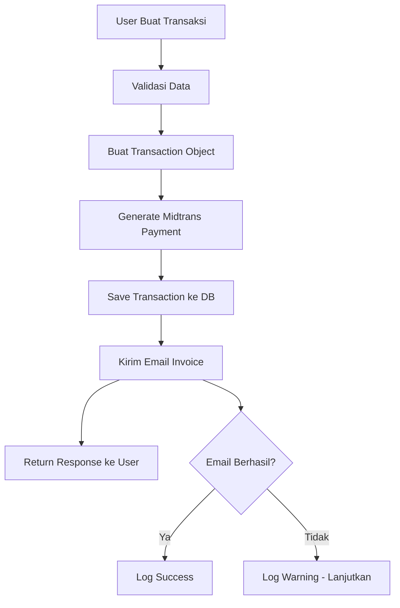
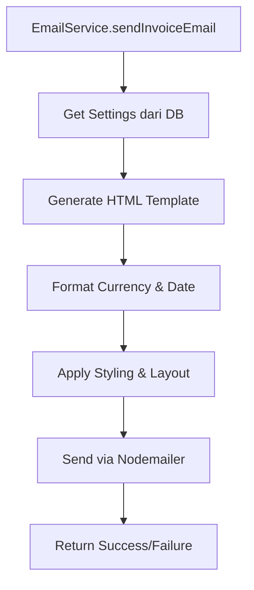

# 📧 Sistem Email Invoice - RBX Store

## Gambaran Umum

Sistem email invoice otomatis yang mengirim email invoice kepada customer setiap kali transaksi dibuat. Email dikirim menggunakan Nodemailer dengan template HTML yang responsif dan professional.

## ✨ Fitur Utama

### 🔄 Pengiriman Otomatis

- Email invoice dikirim otomatis saat transaksi dibuat
- Template email responsif dan professional
- Dukungan HTML email dengan styling lengkap

### 📋 Template Invoice Lengkap

- **Header**: Logo dan nama toko yang dapat dikustomisasi
- **Informasi Invoice**: ID, tanggal, status pembayaran
- **Detail Customer**: Nama, email, telepon
- **Informasi Akun Roblox**: Username (password disembunyikan)
- **Detail Joki**: Khusus untuk layanan joki (jenis game, target level, dll)
- **Tabel Pesanan**: Item, kuantitas, harga, total
- **Instruksi Pembayaran**: Tombol pembayaran untuk transaksi pending
- **Catatan Penting**: Panduan keamanan dan informasi penting
- **Footer**: Kontak support dan informasi toko

### ⚙️ Konfigurasi Flexible

- Support multiple email providers (Gmail, Outlook, Yahoo, Custom SMTP)
- Konfigurasi SMTP yang dapat disesuaikan
- Email credentials yang aman
- Test email functionality

### 🛡️ Keamanan & Reliability

- Password Roblox disembunyikan dalam email (ditampilkan sebagai ••••••••••)
- Validation email configuration
- Error handling yang robust
- Tidak memblokir proses transaksi jika email gagal

## 📁 Struktur File

```
├── lib/
│   └── email.ts                    # EmailService class
├── app/api/
│   ├── email/
│   │   ├── invoice/route.ts        # Resend invoice email
│   │   └── test/route.ts           # Test email configuration
│   └── transactions/route.ts       # Integrasi email di create transaction
├── components/admin/
│   └── EmailSettingsForm.tsx       # Form konfigurasi email admin
├── models/
│   └── Settings.ts                 # Model dengan email configuration
└── docs/
    └── EMAIL_INVOICE_SYSTEM.md     # Dokumentasi ini
```

## 🔧 Setup & Konfigurasi

### 1. Install Dependencies

```bash
pnpm add nodemailer @types/nodemailer
```

### 2. Konfigurasi Email di Admin Settings

Buka halaman admin settings dan atur:

**Untuk Gmail:**

- Provider: Gmail
- SMTP Host: smtp.gmail.com
- Port: 587
- Email User: your-email@gmail.com
- Email Password: [App Password] _bukan password biasa_
- Secure: false

**Untuk Outlook:**

- Provider: Outlook
- SMTP Host: smtp-mail.outlook.com
- Port: 587
- Email User: your-email@outlook.com
- Email Password: [Password email Anda]
- Secure: false

**Untuk Custom SMTP:**

- Provider: Custom SMTP
- SMTP Host: [SMTP server Anda]
- Port: [Port SMTP]
- Email User: [Username SMTP]
- Email Password: [Password SMTP]
- Secure: true/false sesuai konfigurasi

### 3. Setup Gmail App Password (Untuk Gmail)

1. Buka Google Account settings
2. Pilih "Security" → "2-Step Verification"
3. Scroll ke bawah dan pilih "App passwords"
4. Generate app password untuk "Mail"
5. Gunakan app password tersebut, bukan password Google biasa

### 4. Test Konfigurasi

1. Buka form konfigurasi email di admin
2. Masukkan email untuk test
3. Klik "Test Email"
4. Periksa email Anda untuk memastikan konfigurasi benar

## 🚀 Cara Kerja

### 1. Flow Transaksi Normal



### 2. Template Email Generation



## 📧 API Endpoints

### POST /api/transactions

- **Fungsi**: Membuat transaksi baru dan mengirim email invoice
- **Email Trigger**: Otomatis setelah transaksi berhasil disimpan
- **Response**: Termasuk informasi email status di console log

### POST /api/email/invoice

```json
{
  "transactionId": "string",
  "invoiceId": "string",
  "email": "string" // optional, override email
}
```

- **Fungsi**: Kirim ulang email invoice
- **Use Case**: Customer kehilangan email, update email address

### POST /api/email/test

```json
{
  "testEmail": "test@example.com"
}
```

- **Fungsi**: Test konfigurasi email
- **Response**: Status dan detail konfigurasi

## 🎨 Template Email Features

### 📱 Responsive Design

- Mobile-friendly layout
- Flexible table design
- Optimized untuk berbagai email client

### 🎯 Professional Styling

- Gradient header dengan brand colors
- Clean typography dengan Segoe UI font
- Status badges dengan color coding
- Hover effects dan transitions

### 📊 Rich Content

- **Status Badges**: Color-coded payment status
- **Service Icons**: Visual indicators untuk jenis layanan
- **Formatted Currency**: Format Rupiah yang proper
- **Localized Dates**: Format tanggal Indonesia
- **Contact Information**: Multi-channel support info

### 🔒 Security Features

- Password Roblox di-mask (••••••••••)
- Data akun aman dan terlindungi
- Disclaimer tentang keamanan akun

## 🛠️ Customization

### 1. Mengubah Template Email

Edit file `lib/email.ts` pada method `generateInvoiceTemplate()`:

```typescript
// Ubah styling
const customStyles = `
  .header { background: your-gradient; }
  .content { padding: your-padding; }
`;

// Tambah section baru
const customSection = `
  <div class="custom-section">
    <h3>Custom Content</h3>
    <p>Your custom content here</p>
  </div>
`;
```

### 2. Menambah Email Triggers

Tambahkan trigger email di tempat lain:

```typescript
import EmailService from "@/lib/email";

// Contoh: Kirim email saat status berubah
const sendStatusUpdateEmail = async (transaction) => {
  const emailSent = await EmailService.sendEmail({
    to: transaction.customerInfo.email,
    subject: `Status Update - ${transaction.invoiceId}`,
    html: generateStatusUpdateTemplate(transaction),
  });
};
```

### 3. Custom Email Templates

Buat template baru untuk kebutuhan khusus:

```typescript
// lib/email.ts
static async sendCustomEmail(type: 'welcome' | 'reminder' | 'completion', data: any) {
  const templates = {
    welcome: generateWelcomeTemplate(data),
    reminder: generateReminderTemplate(data),
    completion: generateCompletionTemplate(data)
  };

  return await this.sendEmail({
    to: data.email,
    subject: getSubjectByType(type),
    html: templates[type]
  });
}
```

## 🐛 Troubleshooting

### Email Tidak Terkirim

**1. Periksa Konfigurasi:**

```bash
# Gunakan API test
POST /api/email/test
{
  "testEmail": "your-email@example.com"
}
```

**2. Gmail App Password:**

- Pastikan menggunakan App Password
- 2-Factor Authentication harus aktif
- App Password format: xxxx xxxx xxxx xxxx

**3. SMTP Settings:**

```javascript
// Gmail
{ host: 'smtp.gmail.com', port: 587, secure: false }

// Outlook
{ host: 'smtp-mail.outlook.com', port: 587, secure: false }

// Yahoo
{ host: 'smtp.mail.yahoo.com', port: 587, secure: false }
```

**4. Firewall/Network:**

- Pastikan port 587 tidak diblokir
- Check dengan hosting provider jika di production

### Email Template Rusak

**1. HTML Validation:**

- Check HTML structure
- Validate CSS inline styles
- Test di berbagai email client

**2. Image Loading:**

- Gunakan absolute URLs untuk images
- Host images di CDN atau server yang reliable

### Performance Issues

**1. Email Queue:**
Untuk production, gunakan queue system:

```typescript
// Tambah ke queue instead of direct send
await EmailQueue.add("send-invoice", {
  transactionId: transaction._id,
  email: transaction.customerInfo.email,
});
```

**2. Rate Limiting:**

```typescript
// Tambah rate limiting untuk prevent spam
const lastEmailSent = await redis.get(`email:${email}`);
if (lastEmailSent && Date.now() - lastEmailSent < 60000) {
  throw new Error("Rate limit exceeded");
}
```

## 📈 Monitoring & Analytics

### 1. Email Metrics

Track email performance:

```typescript
// Log email events
const emailLog = {
  transactionId: transaction._id,
  email: transaction.customerInfo.email,
  status: "sent" | "failed",
  timestamp: new Date(),
  provider: settings.emailProvider,
};
```

### 2. Success Rate Monitoring

```typescript
// Calculate email success rate
const calculateEmailSuccessRate = async (period: "day" | "week" | "month") => {
  const total = await EmailLog.countDocuments({
    createdAt: { $gte: getPeriodStart(period) },
  });
  const successful = await EmailLog.countDocuments({
    status: "sent",
    createdAt: { $gte: getPeriodStart(period) },
  });
  return (successful / total) * 100;
};
```

## 🔮 Future Enhancements

### 1. Multi-Language Support

- Template email dalam berbagai bahasa
- Auto-detect customer language preference

### 2. Advanced Templates

- Dynamic content berdasarkan customer history
- Personalized recommendations
- Rich media support

### 3. Email Campaign Features

- Newsletter subscription
- Promotional emails
- Abandoned cart reminders

### 4. Advanced Analytics

- Open rate tracking
- Click through rate
- Email client analytics

---

## 📞 Support

Jika ada pertanyaan atau issue terkait sistem email invoice:

1. **Check Logs**: Periksa console log untuk error details
2. **Test Configuration**: Gunakan endpoint `/api/email/test`
3. **Validate Settings**: Pastikan semua field email configuration terisi
4. **Provider Specific**: Check dokumentasi provider email (Gmail, Outlook, dll)

**Email Template Preview**: Test di https://htmlemailcheck.com/ untuk kompatibilitas email client

---

_Dokumentasi ini akan diupdate seiring pengembangan sistem email invoice._
